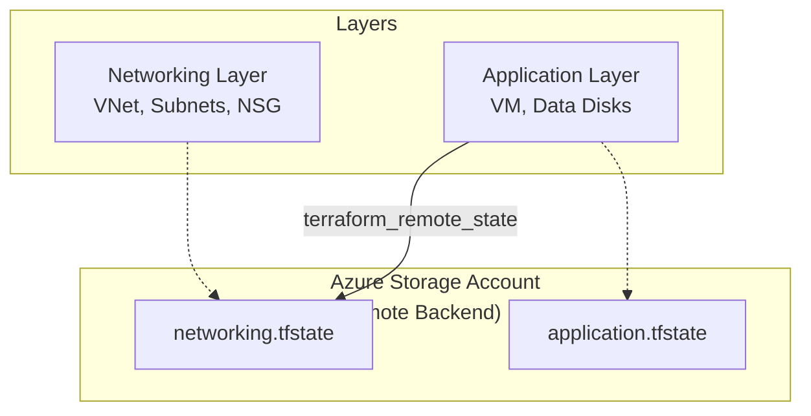
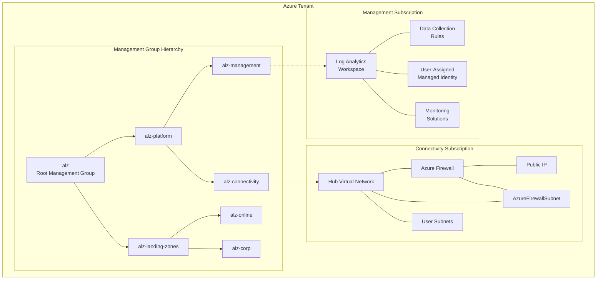
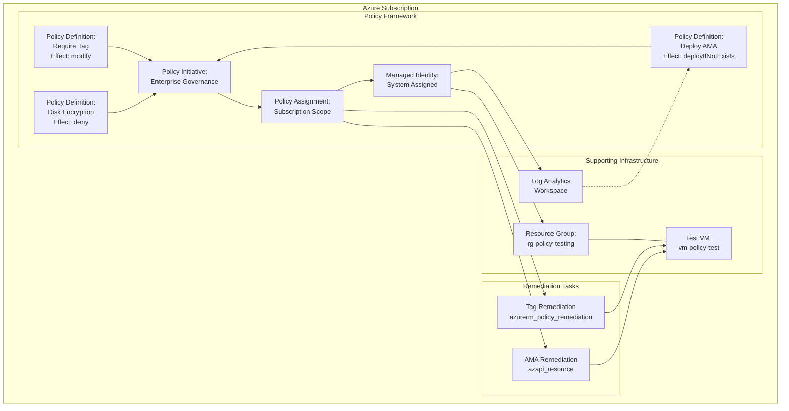
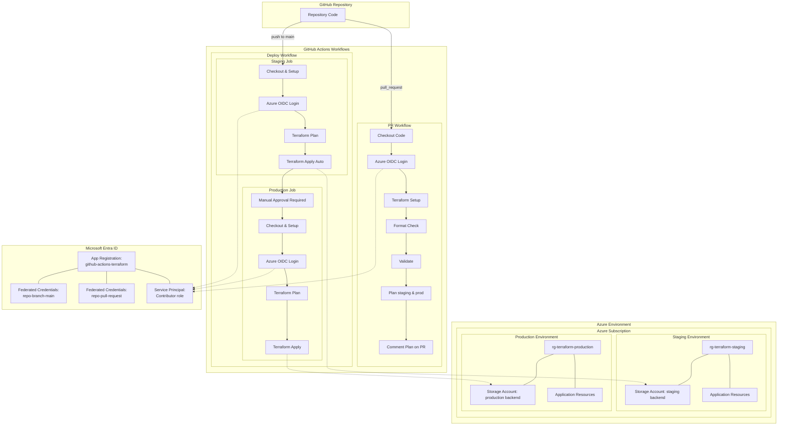

# Terraform Advanced Workshop

This lab series maps directly to the five advanced course modules. Each lab is self‑contained, builds real Azure artifacts, and reinforces enterprise patterns (layered architecture, landing zones with AVM, hybrid management, DevSecOps CI/CD, security & governance, brownfield + AI enablement).

## Lab Index
| Lab | Title | Core Focus | Key Azure Services | GitHub / Tooling Focus |
| --- | ----- | ---------- | ------------------ | ---------------------- |
| lab1 | Remote State & Layered Architecture | Secure azurerm backend, state locking, versioning, cross-layer data | Storage Account, Resource Group, VNet, Subnets, Linux VM | Basic workflow: init/plan/apply locally |
| lab2 | Landing Zone Foundation with AVM | CAF hierarchy, management groups, multi-subscription networking | Management Groups, Log Analytics, Hub VNet, Firewall (logical) | Module composition & multi-provider patterns |
| lab3 | Advanced Policy as Code & Remediation | Initiative + deployIfNotExists + remediation | Azure Policy (definitions, initiative, assignments), Log Analytics | Policy graph, remediation tasks via Terraform |
| lab4 | Production-Grade GitHub Actions Pipeline | OIDC auth, multi-env plan/apply, approvals | (Reuses lab1 infra) | GitHub Actions (plan/apply workflows) |
| lab5 | Terraform Module Quality Gate & Release Automation | Module test, lint, security & semantic release | Terratest, TFLint, Checkov, GitHub Actions, Tags | Automated quality gates & version tagging |

---
## Global Prerequisites (Before Any Lab)
1. Azure Subscription with Contributor (or Owner for management group operations in lab2) rights.
2. Azure CLI installed and logged in: `az login`.
3. Terraform >= 1.7 installed.
4. Git installed and repository cloned locally.
5. VS Code with Terraform & (optionally) GitHub Copilot extensions.
6. Environment variables (adjust naming):
   - `export TF_VAR_location="southeastasia"`
   - `export ARM_SUBSCRIPTION_ID=$(az account show --query id -o tsv)`
   - For multi-subscription in lab2: set `MGMT_SUB_ID` and `CONN_SUB_ID` if distinct.
7. Enable feature flags (if required) for any preview resources you use.

> Cost Control: Destroy lab resources when finished (`terraform destroy`) except shared state RG/storage if reused.

---
## Lab 1: Remote State & Layered Architecture
### Objective
Implement a production-ready Terraform remote state backend using Azure Blob Storage with state locking and versioning, then design a layered infrastructure architecture with separate state files for networking and application tiers that share data via `terraform_remote_state` data sources.

### Key Learning Outcomes
- Configure secure Azure Blob Storage remote backend with state locking
- Implement Terraform workspace and state file isolation strategies
- Design and implement layered infrastructure architecture
- Share data between Terraform configurations using remote state data sources
- Apply enterprise-grade state management and dependency patterns

### Architecture


### Prerequisites
- Azure CLI authenticated with Contributor permissions
- Terraform >= 1.7 installed
- Ability to create storage accounts and assign RBAC roles
- Basic understanding of Terraform state concepts

### Success Criteria
- ✅ Secure Azure Blob Storage backend configured with versioning and soft delete
- ✅ State locking implemented using Azure Storage Account blob lease
- ✅ Three independent state files: backend, networking, and application
- ✅ Application layer successfully references networking outputs via remote state
- ✅ Linux VM deployed in subnet created by networking layer
- ✅ Proper resource group and storage account security configurations

For detailed step-by-step instructions, see [Lab 1 README](solutions/lab1/README.md).

---
## Lab 2: Landing Zone Foundation with AVM
### Objective
Deploy a Cloud Adoption Framework (CAF) compliant Azure Landing Zone using Azure Verified Modules (AVM) with proper management group hierarchy, centralized logging, and hub networking across multiple subscriptions using advanced Terraform provider patterns.

### Key Learning Outcomes
- Implement multi-subscription Terraform deployments with provider aliases
- Deploy Azure Landing Zone foundation using Azure Verified Modules
- Configure management group hierarchy with policies and governance
- Set up centralized logging and monitoring infrastructure
- Deploy hub networking with Azure Firewall for secure connectivity

### Architecture


### Prerequisites
- Tenant-level Management Group write permissions (Owner or User Access Administrator role)
- Two Azure subscription IDs (management and connectivity subscriptions)
- Azure CLI authenticated with appropriate permissions
- Terraform >= 1.7 installed
- Required Azure providers registered

### Success Criteria
- ✅ Management group hierarchy deployed with CAF-aligned structure (e.g., `alz`, `alz-platform`, `alz-landing-zones`)
- ✅ Azure Landing Zone policies and role definitions properly assigned
- ✅ Log Analytics workspace deployed in management subscription with monitoring solutions
- ✅ Hub virtual network with Azure Firewall deployed in connectivity subscription  
- ✅ Data collection rules for Azure Monitor Agent configured
- ✅ All resources deployed across two subscriptions in a single Terraform plan
- ✅ Proper provider configuration with aliases for multi-subscription deployment

For detailed step-by-step instructions, see [Lab 2 README](solutions/lab2/README.md).

---
## Lab 3: Advanced Policy as Code & Remediation
### Objective
Implement enterprise-grade Azure Policy governance using custom policy definitions, policy initiatives, and automated remediation. Author custom policies with different effects (modify, deny, deployIfNotExists), group them into initiatives, assign with parameters, and orchestrate remediation tasks via Terraform.

### Key Learning Outcomes
- Create custom Azure Policy definitions using Policy as Code patterns
- Implement different policy effects: modify, deny, and deployIfNotExists
- Design and deploy policy initiatives (policy sets) for coherent governance
- Configure automated policy remediation using Terraform
- Apply enterprise-scale policy governance with proper RBAC

### Architecture


### Prerequisites
- **Azure Permissions**: Owner or Policy Contributor role on subscription
- **Tools**: Azure CLI v2.50+, Terraform v1.7+, SSH key pair
- **Azure Providers**: PolicyInsights, Authorization, Compute, Network, OperationalInsights

### Policy Set
1. **Custom policy**: Require specific tags (e.g., `cost-center`). Effect: `modify` to add if missing.
2. **Custom policy**: Enforce disk encryption. Effect: `deny` if not enabled.
3. **deployIfNotExists policy**: Ensure Azure Monitor Agent installed on Linux VMs.
4. **Initiative**: Groups the above with parameters (tag key, tag value, workspace ID).

### Steps
1. **Preparation**: Run `./prepare.sh` to validate environment and setup prerequisites.
2. **Policy Framework**: Deploy custom policy definitions, initiative, and subscription assignment.
3. **Test Infrastructure**: Create non-compliant VM and supporting resources for testing.
4. **Remediation**: Execute automated remediation tasks via Terraform.
5. **Validation**: Verify compliance through Azure Portal and CLI.

### Terraform Focus
- Policy as Code patterns with JSON template files
- Policy initiative composition and parameterization
- Automated remediation orchestration using multiple providers
- Enterprise governance with proper RBAC implementation

### Validation
- Policy compliance dashboard shows all resources compliant post-remediation
- Test VM has required tag auto-added and AMA extension installed
- Manual creation of new resources demonstrates policy enforcement

### Success Criteria
- ✅ Custom policies deployed with different effects (modify, deny, deployIfNotExists)
- ✅ Policy initiative created and assigned at subscription scope
- ✅ Automated remediation executed without manual portal intervention
- ✅ Policy enforcement demonstrated on new resource creation
- ✅ Compliance monitoring and reporting functional in Azure Portal

For detailed step-by-step instructions, see [Lab 3 README](solutions/lab3/README.md).

---
## Lab 4: Production-Grade GitHub Actions CI/CD Pipeline
### Objective
Implement a production-ready CI/CD pipeline for Terraform using GitHub Actions with OpenID Connect (OIDC) authentication, automated planning on pull requests, multi-environment deployments with approval gates, and secure state management across staging and production environments.

### Key Learning Outcomes
- Configure OpenID Connect (OIDC) authentication between GitHub Actions and Azure
- Implement automated Terraform plan generation and PR commenting
- Design multi-environment deployment workflows with approval controls
- Set up environment protection rules and deployment gates
- Apply Infrastructure as Code (IaC) best practices in CI/CD pipelines
- Implement secure secret management without long-lived credentials

### Architecture


### Prerequisites
- **GitHub Repository**: Personal or organization repository with Actions enabled
- **Azure Permissions**: Contributor or Owner role on target subscription
- **Azure CLI**: Installed and authenticated for initial setup
- **Microsoft Entra ID**: Permissions to create App Registrations and assign roles
- **GitHub Secrets**: Repository or environment-level secrets configuration
- **Basic Terraform Knowledge**: Understanding of state management and backends

### Success Criteria
- ✅ OIDC authentication configured without long-lived secrets stored in GitHub
- ✅ Automated Terraform plan generation and PR commenting on pull requests
- ✅ Multi-environment deployment with staging (automatic) and production (manual approval)
- ✅ Environment protection rules enforced for production deployments
- ✅ Separate state files and backends for staging and production environments
- ✅ Workflow security best practices implemented (least privilege, secure outputs)
- ✅ Proper error handling and rollback capabilities
- ✅ Infrastructure drift detection and remediation capabilities

For detailed step-by-step instructions, see [Lab 3 README](solutions/lab3/README.md).


---

## Lab 5: Terraform Module Quality Gate & Release Automation
### Objective
Establish a reusable Terraform module with automated tests, linting, security scan, semantic version tagging, and release notes generation.

### Prerequisites
- GitHub repository with Actions enabled.
- Go toolchain (for Terratest) available in workflow runners.

### Module Structure
```
modules/
  web_app/
    main.tf
    variables.tf
    outputs.tf
    README.md
examples/
  basic/
    main.tf
```

### Steps
1. Implement module (e.g., App Service + optional slot) with input variables (name, location, sku, tags).
2. Write example usage under `examples/basic`.
3. Add tests: `tests/web_app_test.go` using Terratest to init/plan and assert output naming patterns.
4. GitHub Actions workflow `ci.yml`:
   - tflint + terraform fmt + validate
   - terraform init/plan on example
   - run Checkov
   - run Terratest (go test ./tests -timeout 30m)
5. On tag push `v*.*.*` run release workflow:
   - Re-run tests
   - Generate CHANGELOG (e.g., conventional commits parser action)
   - Create GitHub Release attaching plan artifact and changelog.
6. Add semantic version bump workflow (manual dispatch or commit message driven) that calculates next version and creates tag.

### Terraform Focus
- Module input validation (variable `validation` blocks), version constraints, defensive outputs.
- Example-driven test harness with Terratest.

### Validation
- PR must pass all quality gates before merge.
- Creating a tag `v0.1.0` auto-produces release with changelog + test pass.

### Success Criteria
- Fully automated module pipeline; failed gate blocks release.

