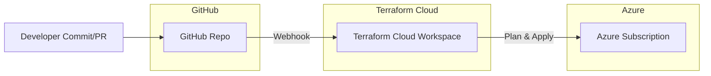

## Lab 7 – Terraform Cloud + GitHub VCS Workflow Deploying Azure

Integrate Terraform Cloud (TFC) with a GitHub repository to provision secure Azure infrastructure using remote state, run tasks / policies, and a GitHub Actions pipeline hand‑off. This lab focuses on the end‑to‑end workflow: local authoring → VCS trigger in TFC → optional GitHub Actions orchestration → Azure apply with least privilege.

---

## 1. Learning Objectives
By the end you will be able to:
* Connect a GitHub repo to a Terraform Cloud workspace (VCS driven)
* Configure Terraform Cloud remote state & execution mode (remote)
* Use Azure OIDC (no static creds) in Terraform Cloud via Workload Identity / Service Principal
* Manage sensitive & non‑sensitive variables in TFC (env vs Terraform vars)
* Enforce a simple Sentinel / OPA-style policy check (conceptual stub) or run tasks hook (e.g. cost)
* Trigger plans via PRs and applies via merges using the VCS workflow
* (Optional) Chain a GitHub Action after successful TFC apply (notification / deployment step)
* Detect drift with speculative plan and optional scheduled runs

## 2. What You Will Build
Minimal Azure footprint managed by Terraform Cloud:
* Resource Group
* Storage Account (standard LRS) – demonstrates naming constraints & tagging

The emphasis is the workflow integration rather than complex Azure resources.

## 3. Architecture Overview

Execution mode: Remote (Terraform Cloud runs terraform; state stored in TFC). Azure credentials injected as environment variables referencing a Federated Credential (OIDC) Service Principal.

## 4. Prerequisites
| Item | Details |
|------|---------|
| Terraform Cloud Account | Free tier ok (create org) |
| GitHub Repo | This workshop repository fork or clone |
| Azure Subscription | Rights to create App Registration + role assignment |
| Local Tools | terraform, az, gh, bash |
| Auth | `az login`, `gh auth login` |
| Variables | Terraform Cloud org name, desired workspace name |

## 5. Quick Start (High Level)
1. Create / identify Azure Service Principal with federated credential for GitHub (reuse Lab 4/5 if available) OR create one dedicated to lab7.
2. In Terraform Cloud: create organization (if new) and a workspace (VCS workflow) pointing to this repo folder `solutions/lab7`.
3. Add variables in TFC:
   * Terraform variables (Category: Terraform): `location`, `resource_group_name` (optional overrides)
   * Environment variables (Category: Env): `ARM_CLIENT_ID`, `ARM_TENANT_ID`, `ARM_SUBSCRIPTION_ID` (sensitive as needed)
4. Replace placeholders in `versions.tf` cloud block (organization + workspace name) OR remove and set via CLI/TFC workspace settings.
5. Commit & push a change – TFC queues a plan (speculative for PR, confirm/apply on main if auto‑apply enabled).
6. Observe plan & apply in TFC UI; inspect state & outputs.

## 6. Repository Layout (Lab 7)
```
solutions/lab7/
  README.md
  versions.tf
  variables.tf
  main.tf
  (optional) prepare.sh
```

## 7. Terraform Cloud Workspace Setup
1. In TFC UI: New Workspace → Version Control workflow.
2. Connect GitHub OAuth (or GitHub App) → select this repository.
3. Set working directory: `solutions/lab7`.
4. Execution Mode: Remote.
5. Apply Method: (a) Auto apply (fast iteration) or (b) Manual (safer for production patterns).
6. Save workspace.

### 7.1 Variables in TFC
| Type | Name | Example | Sensitive | Notes |
|------|------|---------|-----------|-------|
| Env | ARM_CLIENT_ID | <appId> | Yes | Azure auth |
| Env | ARM_TENANT_ID | <tenantId> | No | |
| Env | ARM_SUBSCRIPTION_ID | <subId> | No | |
| Terraform | location | eastus | No | Overrides default |
| Terraform | resource_group_name | lab7-rg | No | Custom RG name |
| Terraform | storage_account_suffix | xyz123 | No | Ensure global uniqueness |

(If using workload identity federation directly from TFC: export env vars from the SP. For OIDC from TFC to Azure, currently use a client secret or workload identity – prefer secretless where GA; else store CLIENT_SECRET as env var sensitive.)

## 8. Azure Service Principal (Federated) Creation (If Needed)
Use existing script from earlier labs adapting environment claims, or manually:
```bash
APP_NAME="tfc-lab7-sp"
SUBSCRIPTION_ID=$(az account show --query id -o tsv)
TENANT_ID=$(az account show --query tenantId -o tsv)
az ad app create --display-name "$APP_NAME" --query appId -o tsv
# Create service principal
APP_ID=$(az ad app list --display-name "$APP_NAME" --query "[0].appId" -o tsv)
az ad sp create --id "$APP_ID"
az role assignment create --assignee "$APP_ID" --role Contributor --scope "/subscriptions/$SUBSCRIPTION_ID"
# (Optional) Add federated credential referencing GitHub repo (subject patterns as in lab4)
```
Export values into TFC env vars.

## 9. Code Walkthrough
`versions.tf`: Configures provider + Terraform Cloud remote backend (update placeholders).
`variables.tf`: Declares Azure + naming variables.
`main.tf`: Creates a resource group and a storage account (simple LRS, TLS 1.2, tagged). Demonstrates deterministic SA naming with optional suffix.

## 10. Policy / Run Tasks (Conceptual Extension)
You can attach a cost estimation or security run task:
1. Organization Settings → Run Tasks → add (e.g., Infracost, Checkov). 
2. Workspace → Settings → Run Tasks → attach to pre-plan / post-plan.
3. Re-run plan to see gating behavior.

For Sentinel (paid tiers): create a simple policy enforcing a tag key exists. Example (pseudo):
```hcl
# sentinel.hcl (outline, not runnable here)
import "tfplan/v2" as tfplan
main = rule { all tfplan.resource_changes as r { "tags" in r.change.after and "project" in r.change.after.tags } }
```

## 11. GitHub PR Flow
* Open PR → TFC speculative plan runs (no apply).
* Merge PR → main branch push triggers new plan; if auto‑apply enabled, resources change.
* Use TFC notifications (optional) to post status back to VCS checks.

## 12. Drift Detection
Strategies:
* Scheduled TFC runs (API or dummy commit) to detect drift.
* Terraform Cloud's speculative plan triggered via `tfc-agent` (self hosted) if needed.
* Separate GitHub workflow nightly running `terraform plan -detailed-exitcode` (CLI) against same workspace (requires remote backend & token).

## 13. Cleanup
In TFC workspace: Actions → Queue destroy plan → Confirm destroy → Apply.
Then delete workspace (optionally) and Azure role assignment / app registration if dedicated.

## 14. Troubleshooting
| Symptom | Likely Cause | Fix |
|---------|--------------|-----|
| Workspace stuck pending | Missing variable or credentials | Add env vars / re-run |
| Plan fails provider auth | Wrong SP values or missing role | Verify role assignment, IDs |
| Name already taken (storage) | Not unique globally | Add `storage_account_suffix` var |
| No speculative plan on PR | VCS connection not installed | Reconnect GitHub integration |
| Sentinel policy block | Tag missing / rule mismatch | Add required tag or adjust policy |

## 16. Review Questions
1. When would you choose CLI-driven workspace vs VCS-driven?
2. How do run tasks differ from Sentinel policies?
3. What are pros/cons of auto-apply for production?
4. How do you rotate Azure credentials without downtime in TFC?
5. How do you extend this pattern for multi-environment (workspaces vs directories)?

## 17. Next Extensions
* Add Infracost run task for cost feedback
* Introduce OPA policy evaluation via plan JSON export
* Integrate notifications (Slack/Teams) using TFC notification triggers
* Migrate to workload identity (secretless) if/when fully supported

---
This lab emphasizes workflow integration simplicity. Expand resources (AKS, App Service, Key Vault) in future labs using same TFC patterns.
